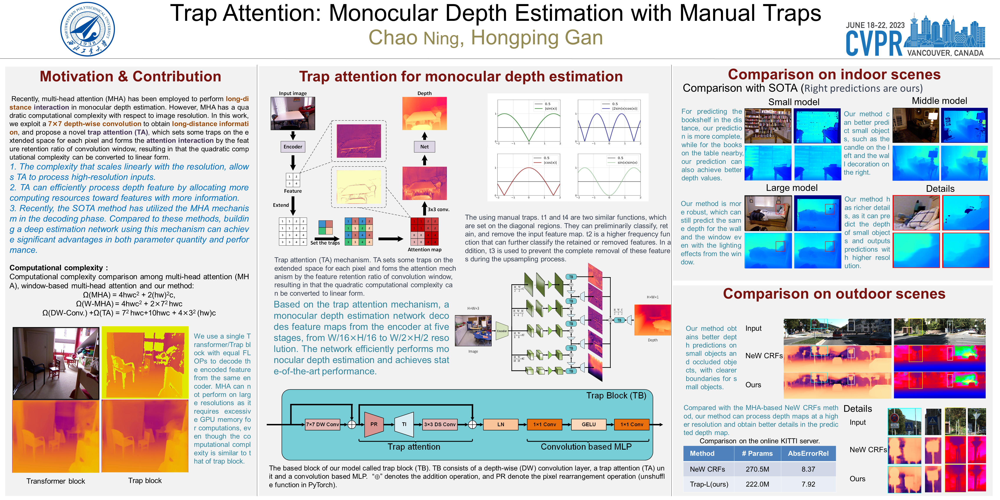

# Trap Attention
The implementation of Trap Attention: Monocular Depth Estimation with Manual Traps



## Environment
- python 3.8
- pytorch 1.7.1


## Citation
If you use this code for a paper, please cite:
```
@inproceedings{ning2023trap,
  title={Trap Attention: Monocular Depth Estimation with Manual Traps},
  author={Chao Ning and Hongping Gan},
  booktitle={Proceedings of the IEEE/CVF International Conference on Computer Vision and Pattern Recognition},
  pages={},
  year={2023}
}
```

## Acknowledgement
This repo benefits from awesome works of [Timm](https://github.com/rwightman/pytorch-image-models),
[Monocular-Depth-Estimation-Toolbox](https://github.com/zhyever/Monocular-Depth-Estimation-Toolbox/tree/main/configs/bts),
[MMSeg](https://github.com/open-mmlab/mmsegmentation)
and
[Monocular-Depth-Estimation-Toolbox](https://github.com/zhyever/Monocular-Depth-Estimation-Toolbox).


